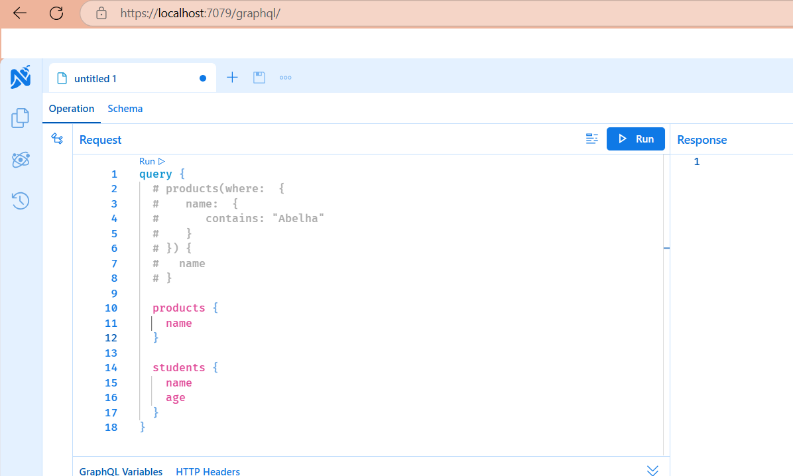
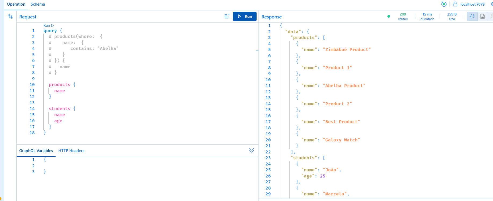
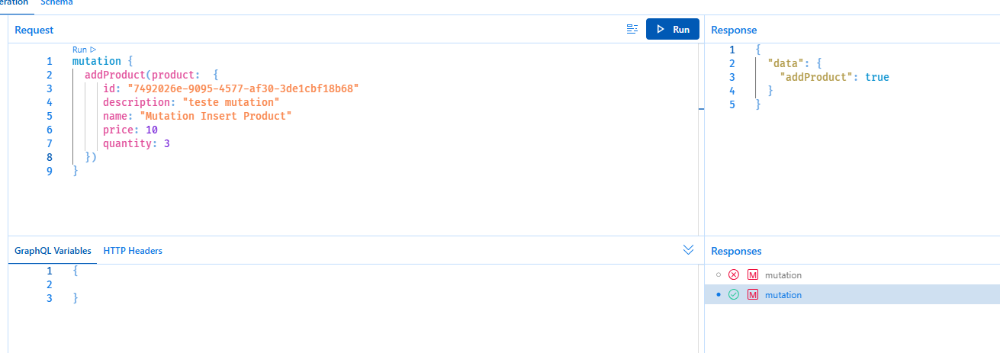
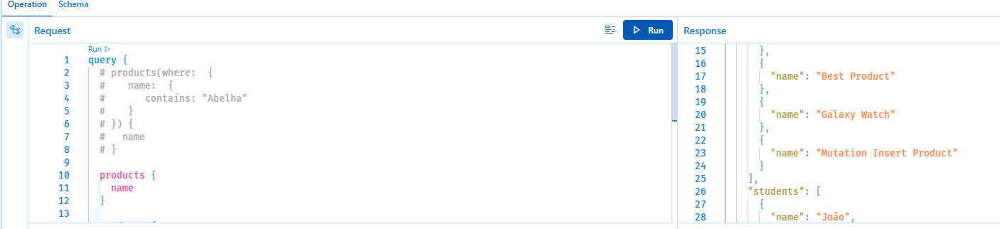

# GraphQL
Exemplo de uma api utilizando arquitetura GraphQL.
Também é uma API REST (endpoints e swagger), utilizando EntityFramework Core com bando de dados sqlite.

É possível alterar o nome do banco no appsettings.json

Existem arquivos de configuração para criar uma massa inicial para as tabelas "Products" e "Students" (arquivos ProductContextConfiguration.cs e StudentContextConfiguration.cs)

Nos repositórios só foram criados métodos para listar e adicionar.
Como a intenção da aplicação é mostrar o básico de um GraphQL, não investi tempo em CRUD, validações, tratamento de exceções, etc...

Para testar o GraphQL, ao iniciar o projeto, pegue a url principal e adicione /graphql/, exemplo: https://localhost:7079/graphql/  (remova o conteúdo do swagger)

---

**Query (consulta)**

Na imagem acima é possível ver um exemplo onde, pela query, você pode fazer consulta informando qual ou quais campos deseja trazer da consulta.
Talvez em uma aplicação não fizesse sentido ter entidades como Produto e Aluno no mesmo projeto, mas coloquei justamente para mostrar o ponto positivo ao usar GraphQL.

A parte comentada é para mostrar que é possível filtrar e, não está na imagem, mas é possível ordenar também.

Ao utilizar REST, teríamos que fazer duas chamadas GET, uma para /products e outra para /students. Além de receber todos os campos que o backend envia (neste exemplo não usei DTO, então retorna todas as colunas do banco de dados).

Já utilizando GraphQL o "consumidor" pode escolher o que deseja receber de informação. Poderia até mesmo só buscar por produtos e "descartar" a busca por alunos.

---

**Mutation (neste exemplo, para cadastro)**

O type Mutation serve para definir o contrato de manipulação de dados. A funcionalidade dele é comparável com a dos verbos POST, PUT, PATCH e DELETE de APIs REST

---

Obviamente foi um exemplo bem simples e não mostra todo o potencial do GraphQL. É algo mais complexo de se trabalhar (comparado a API Rest).

Site oficial: https://graphql.org/

Biblioteca do HotChocolate para .Net: https://chillicream.com/docs/hotchocolate/v13/get-started-with-graphql-in-net-core